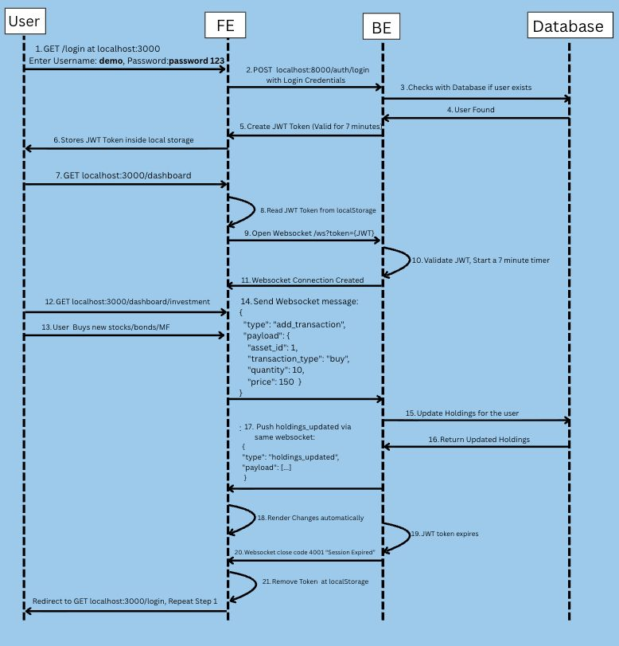

# Manulife Portfolio Management

A full-stack portfolio management application built with **Next.js**, **FastAPI**, and **PostgreSQL**.

## Tech Stack

- **Frontend:** Next.js
- **Backend:** FastAPI
- **Database:** PostgreSQL

## How to run?
1. Clone the repository
2. cd Manulife_Portfilio_Management
3. Go to these three folders: frontend, backend, docker, and create a .env from .env.example
4. At the root directory, run docker compose build --no-cache, docker compose up

## Scope & Limitations
1. For this demo, an account is automatically created: username: demo, password: password123
2. Dummy data is also automatically loaded at first
3. The JWT token last for 7 minutes, after it expired, you are required to login again

## Sequence Diagram

